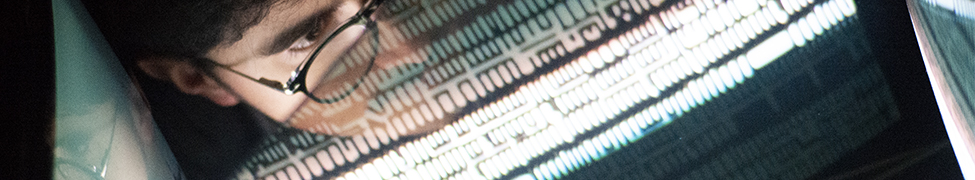

# Download Curriculum Vitae below

email me: henrikferrara@gmail.com

[PDF DOWNLOAD](assets/cv/cv_henrique_ferreira_may2022.pdf)

{:width="100%"}

# Ao vivo | Live Shows
2022
. [Apresentação "Crescente, Gesto e Expressividade para novos instrumentos e interfaces", no Auditório Luís Soares, ESMAD @ IRI 2022](assets/cv/IRI_2022.PNG);
. [Ativação da instalação "Memórias do Tafetá", na exposição RITOS E APOTEOSES na Oficina Cobalto, com Simão Rodrigues e Ricardo M.Vieira][MemoriasTafeta2];
. [Ativação da instalação “Memórias do Tafetá”, na exposição 232º Celsius, com Simão Rodrigues, Guilherme Correia e Francisca Dores][MemoriasTafeta];
. [Apresentação do disco "MÚSICA PARA CASULOS" c/Ig Natz (& the three legged Chick project) Henrik Ferrara e Francisco Babo][CASULOS];
. [Grupo Operário do Ruído & Ignaz Schick @ Associação de Moradores da Bouça][GORIGNAZ];
. [Tuning People Birds and Flowers - Oficina com Paulo Maria Rodrigues / Companha de Música Teatral][BIRDSANDFLOWERS];

2021
. [Espetáculo "a.jun.ta.men.to" do Encerramento do Programa Cultura em Expansão 2021, dirigido pelo coletivo ondamarela;][AJUNTA]
. Performance "Aparafusado à minha loucura", com Simão Collares, na Oficina Cobalto;

2020
. [ATA OWWO + GUILLIO @ Mera's Domestic Rave, Livestream a convite da OLEC][ATAGILOLEC];
. [ATA OWWO + GUILLIO a apresentar "Songs For Green Tea and Peppermint Pope" @ guimarães noc noc 2020][ATAGILNOCNOC];
. Performance "A Arte é Trabalho", com Ana Pinho, Gabriel Correia, Mafalda Covas, Simão Rodrigues e Simão Paulo, no cowork Temporada;
. ["ciclo' siklu" ao vivo com Francisco Oliveira no evento "Síntese nas minas de cobalto", na Oficina Cobalto][SIKLU];
. [Performance "A Arte é Trabalho", com Ana Pinho, Filipe Tootil, Mafalda Covas e Simão Rodrigues, na inauguração da Oficina Cobalto][INAU_COBALTO];

2019
. ["Oficina de experimentação e alteração de circuitos eletrónicos e geradores de ruído" #MO1, Circular Festival, com Miguel Pipa, Francisca Dores e Pedro Afonso][MODOS];
. [Livestream "ATA OWWO + GUILLIO" na Esmad TV][ATAGILESMAD];
. ["Rito: A Transformação das Cinzas" com LickSickDick, no Teatro Helena Sá e Costa](/assets/cv/cartaz_rito_19_lsd.jpg);

2018
. [Live Music & SFX em "A Guerra para acabar com todas as Guerras", na Fábrica da Alegria][AGUERRA];

# Exposições | Exhibits
2021
. [Exposição coletiva "LANDSCAPES - CICLOS DA PAISAGEM I" na Oficina Cobalto](/assets/cv/landscapes2_cobalto_2021.jpg);

2020
. [Exposição coletiva “Cobalto, o demónio das minas” na Oficina Cobalto](/assets/cv/cobalto2020_expo_col.jpg);

2019  
. [Instalação “O Covil” na Casa D’Artes do Bonfim][OCOVIL];
. [Exposição das imagens "Nus para manequim" na exposição coletiva "CRÚ", na Casa D'Artes do Bonfim][LINKNUS];

2018 
. [Exposição das imagens dos "Bastidores da Guerra para acabar com todas as Guerras" na Fábrica da Alegria][FOTOSAGUERRA];
. [Exposição do projeto "Sardão" no CPF (Centro Português de Fotografia) no contexto da mostra dos trabalhos finais da licenciatura em TCAV][FOTOSSARDAO];

[AGUERRA]: https://youtu.be/j26LGHuq4WI
[ATAGILESMAD]: https://youtu.be/tlLY3H3FFDs
[MODOS]: https://www.instagram.com/p/B3-Zv7mJe4n/
[INAU_COBALTO]: https://youtu.be/3XxuQCeeTZw
[SIKLU]: https://youtu.be/FtGh3A-eWp4
[ATAGILNOCNOC]: https://www.thresholdmagazine.pt/2020/10/fotogaleria-ata-owwo-guillio-guimaraes.html
[ATAGILOLEC]: https://youtu.be/aMxW1Y3qvkA
[FOTOSSARDAO]: https://sites.google.com/view/henrik-ferrara/works/photography#h.qat9ir3bz6xm
[FOTOSAGUERRA]: https://sites.google.com/view/henrik-ferrara/works/photography#h.8807bp2yfv47
[LINKNUS]: https://sites.google.com/view/henrik-ferrara/works/photography?authuser=0#h.hvevk8qo9iba
[OCOVIL]: https://youtu.be/VkEyyWvcuZY
[BIRDSANDFLOWERS]:https://www.facebook.com/media/set/?vanity=CulturaEmExpansao&set=a.3182831341945773
[AJUNTA]: https://www.culturaemexpansao.pt/multimedia-detalhe/a-jun-ta-men-to-ondamarela/
[GORIGNAZ]: https://www.culturaemexpansao.pt/sessao/grupo-operario-do-ruido-andamp-ignaz-schick/
[CASULOS]: https://fb.me/e/3dxBC6nRj
[MemoriasTafeta]: https://www.instagram.com/reel/Ck_Rno0Jj0C/
[MemoriasTafeta2]: https://www.instagram.com/p/CmUdbErs8eT/
